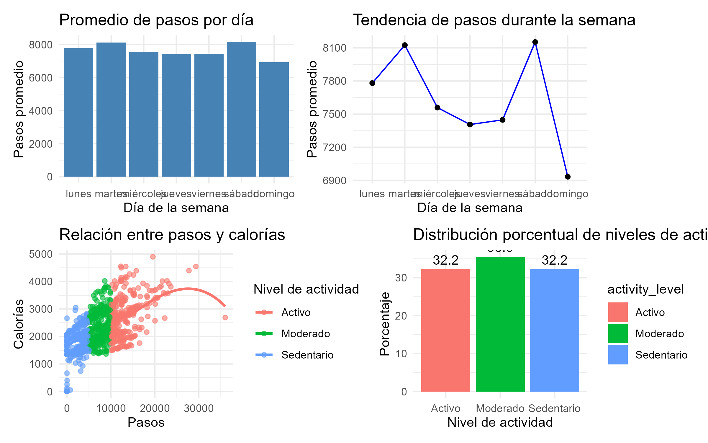
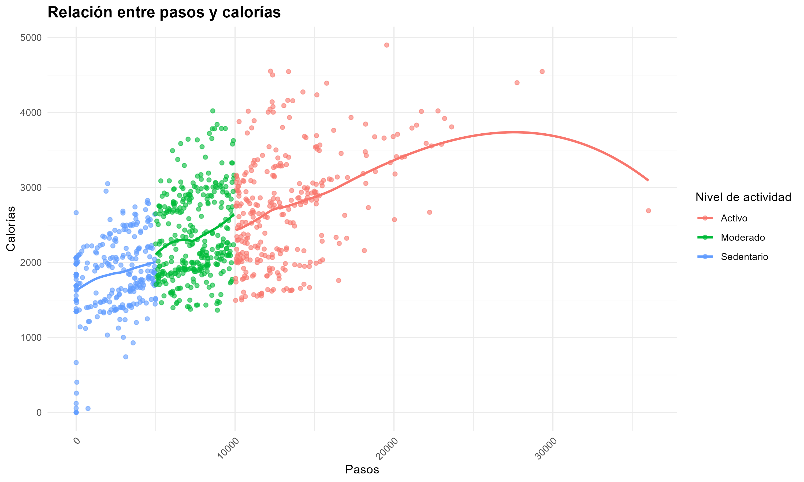
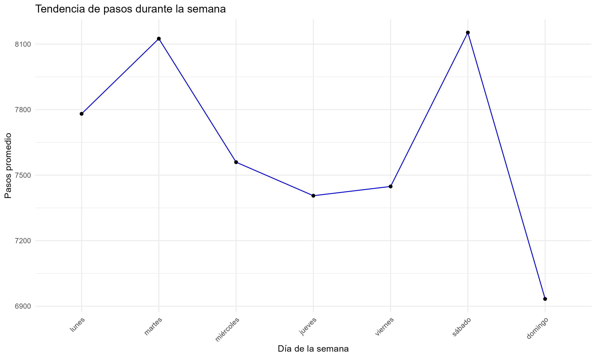
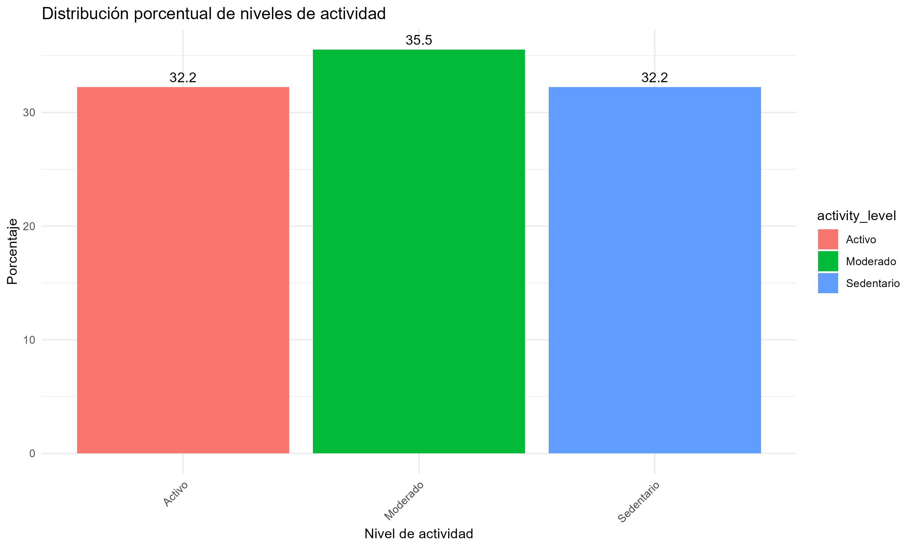

# 📊 Bellabeat Case Study

## 📌 Introducción
En este proyecto se realizó un análisis de datos utilizando información de Fitbit para identificar patrones de actividad física y generar recomendaciones estratégicas para Bellabeat.

---

## 🎯 Objetivo del negocio
El objetivo es comprender el comportamiento de los usuarios en relación con su actividad diaria, pasos, calorías quemadas y niveles de actividad para ayudar a Bellabeat a tomar decisiones basadas en datos.

---

## 🧹 Proceso de análisis
- Limpieza y transformación de datos en R
- Exploración de datos
- Creación de variables
- Análisis de actividad diaria
- Visualización de datos con ggplot2

---

## 📈 Visualizaciones realizadas

📊 

---

🔵 

---

📈

---

 

---

## 💡 Insights principales
- La actividad física cambia según el día de la semana.
- Existe relación entre la cantidad de pasos y las calorías quemadas.
- La mayoría de usuarios presentan niveles de actividad bajos o moderados.

---

## 📣 Recomendaciones
- Implementar recordatorios de actividad.
- Crear retos semanales para aumentar la participación.
- Personalizar recomendaciones según el nivel de actividad del usuario.
- Incorporar elementos de motivación (logros,retos semanales,frases de motivación ).

---

## 🛠️ Herramientas utilizadas
- R
- RStudio
- tidyverse
- ggplot2
- GitHub
